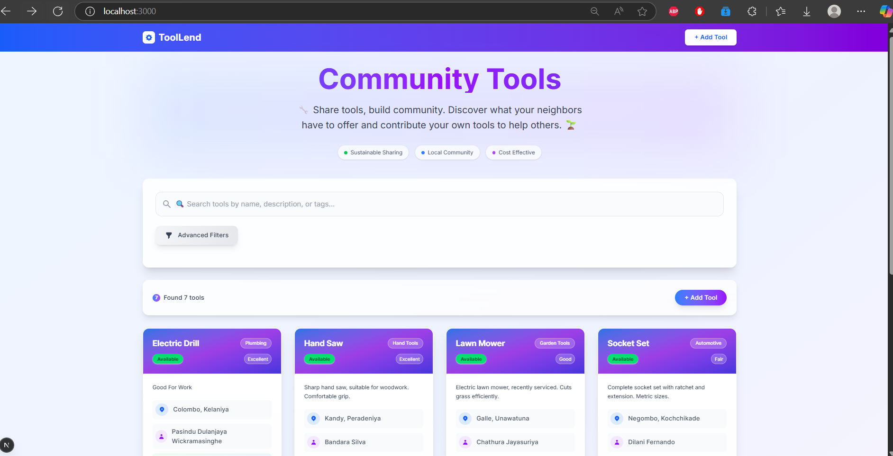

# 🛠️ Community Tool Lending Platform

> Empowering communities to share, save, and sustain — one tool at a time.

A modern, full-stack web application that enables neighborhoods to efficiently share and borrow tools. By leveraging the power of the **MERN stack** — [MongoDB](https://www.mongodb.com/), [Express.js](https://expressjs.com/), [React.js](https://react.dev/), and [Node.js](https://nodejs.org/) — this platform helps reduce costs, promote sustainability, and foster collaboration among neighbors. Built with [Next.js](https://nextjs.org) for a seamless, high-performance user experience.

---

## 🚀 Key Features

- **Tool Listings:** List, browse, and manage available tools in your community.
- **Advanced Search & Filter:** Find tools by category, keyword, location, or availability.
- **Add, Edit & Remove Tools:** Full CRUD operations for tool management.
- **User Authentication:** Secure login and registration (with future support for social logins).
- **User Profiles:** View borrowing/lending history and manage your listings.
- **Ratings & Reviews:** Build trust with a five-star rating and review system.
- **Responsive Design:** Mobile-first, intuitive interface for all devices.
- **Persistent Storage:** Robust MongoDB integration for reliable data storage.
- **Location Awareness:** Search and filter tools by city, area, or postal code.
- **Notifications:** Email notifications for borrowing requests and returns (planned).
- **Admin Dashboard:** (Planned) Manage users, tools, and platform activity.

---

## 🧑‍💻 Technologies Used

<p align="center">
  
  
  
  
  
  
  
</p>

---

## 📋 Table of Contents
- [Key Features](#-key-features)
- [Technologies Used](#-technologies-used)
- [Getting Started](#-getting-started)
- [Usage](#-usage)
- [Screenshots](#-screenshots)
- [Contributing](#-contributing)
- [License](#-license)
- [Contact](#-contact)

---


## ⚡ Getting Started


### Prerequisites
- [Node.js](https://nodejs.org/) (v18 or higher recommended)
- [npm](https://www.npmjs.com/) (comes with Node.js)
- [MongoDB](https://www.mongodb.com/) (local or cloud instance)


### Installation

1. **Clone the repository:**
   ```bash
git clone https://github.com/your-username/community-tool-lending-platform.git
   cd community-tool-lending-platform/my-tool-lending-app
```

2. **Install dependencies:**
   ```bash
npm install
   # or
yarn install
   # or
   pnpm install
   # or
   bun install
```


3. **Configure Environment Variables:**
   
   Create a `.env.local` file in the root of `my-tool-lending-app` and add your MongoDB connection string:
   ```env
MONGODB_URI=your_mongodb_connection_string
```


4. **Run the Development Server:**
   ```bash
npm run dev
   # or
yarn dev
   # or
   pnpm dev
   # or
   bun dev
```

   Open [http://localhost:3000](http://localhost:3000) in your browser to view the app.

---


## 📖 Usage

- **Browse Tools:** View all available tools on the homepage.
- **Search & Filter:** Use the search bar and filters to find tools by category, location, or keyword.
- **Add a Tool:** Click "Add Tool" to list a new item for your community.
- **Edit/Remove:** Manage your listings from your profile or the tool details page.
- **Borrow Tools:** Request to borrow tools from other users (feature in progress).
- **Rate & Review:** Leave feedback after borrowing or lending (coming soon).

---


## 🖼️ Screenshots

> _Add screenshots of your app below. Replace the example image paths with your own._

<p align="center">
  
  <br/>
  <em>Homepage: Browse and search for tools</em>
</p>

<p align="center">
  
  <br/>
  <em>Add Tool: List a new tool for your community</em>
</p>

---


## 🤝 Contributing

We welcome contributions from the community! Whether you want to fix a bug, add a feature, or improve documentation, your help is appreciated.

**How to contribute:**
1. Fork the repository
2. Create your feature branch (`git checkout -b feature/YourFeature`)
3. Commit your changes (`git commit -m 'Add some feature'`)
4. Push to the branch (`git push origin feature/YourFeature`)
5. Open a pull request

For major changes, please open an issue first to discuss what you would like to change.

---


## 📄 License

This project is licensed under the MIT License. See the [LICENSE](../LICENSE) file for details.

---


## 📬 Contact

For questions, suggestions, or feedback, please contact [your-email@example.com](mailto:your-email@example.com).


---

<p align="center">
  <em>Built with ❤️ using Next.js, React, Node.js, Express, and MongoDB.</em>
</p>
*Clone the repository:**
   ```bash
git clone https://github.com/your-username/community-tool-lending-platform.git
   cd community-tool-lending-platform/my-tool-lending-app
```

2. **Install dependencies:**
   ```bash
npm install
   # or
yarn install
   # or
   pnpm install
   # or
   bun install
```


3. **Configure Environment Variables:**
   
   Create a `.env.local` file in the root of `my-tool-lending-app` and add your MongoDB connection string:
   ```env
MONGODB_URI=your_mongodb_connection_string
```


4. **Run the Development Server:**
   ```bash
npm run dev
   # or
yarn dev
   # or
   pnpm dev
   # or
   bun dev
```

   Open [http://localhost:3000](http://localhost:3000) in your browser to view the app.

---


## 📖 Usage

- **Browse Tools:** View all available tools on the homepage.
- **Search & Filter:** Use the search bar and filters to find tools by category, location, or keyword.
- **Add a Tool:** Click "Add Tool" to list a new item for your community.
- **Edit/Remove:** Manage your listings from your profile or the tool details page.
- **Borrow Tools:** Request to borrow tools from other users (feature in progress).
- **Rate & Review:** Leave feedback after borrowing or lending (coming soon).

---


## 🖼️ Screenshots

> _Add screenshots of your app below. Replace the example image paths with your own._

<p align="center">
  
  <br/>
  <em>Homepage: Browse and search for tools</em>
</p>

<p align="center">
  
  <br/>
  <em>Add Tool: List a new tool for your community</em>
</p>

---


## 🤝 Contributing

We welcome contributions from the community! Whether you want to fix a bug, add a feature, or improve documentation, your help is appreciated.

**How to contribute:**
1. Fork the repository
2. Create your feature branch (`git checkout -b feature/YourFeature`)
3. Commit your changes (`git commit -m 'Add some feature'`)
4. Push to the branch (`git push origin feature/YourFeature`)
5. Open a pull request

For major changes, please open an issue first to discuss what you would like to change.

---


## 📄 License

This project is licensed under the MIT License. See the [LICENSE](../LICENSE) file for details.

---


## 📬 Contact

For questions, suggestions, or feedback, please contact [dulanjaya.pasindu1130@gmail.com](mailto:dulanjaya.pasindu1130@gmail.com).


---

<p align="center">
  <em>Built with ❤️ using Next.js, React, Node.js, Express, and MongoDB.</em>
</p>
*Clone the repository:**
   ```bash
git clone https://github.com/Dewick75/community-tool-lending-platform.git
   cd community-tool-lending-platform/my-tool-lending-app
```

2. **Install dependencies:**
   ```bash
npm install
   # or
yarn install
   # or
   pnpm install
   # or
   bun install
```


3. **Configure Environment Variables:**
   
   Create a `.env.local` file in the root of `my-tool-lending-app` and add your MongoDB connection string:
   ```env
MONGODB_URI=your_mongodb_connection_string
```


4. **Run the Development Server:**
   ```bash
npm run dev
   # or
yarn dev
   # or
   pnpm dev
   # or
   bun dev
```

   Open [http://localhost:3000](http://localhost:3000) in your browser to view the app.

---


## 📖 Usage

- **Browse Tools:** View all available tools on the homepage.
- **Search & Filter:** Use the search bar and filters to find tools by category, location, or keyword.
- **Add a Tool:** Click "Add Tool" to list a new item for your community.
- **Edit/Remove:** Manage your listings from your profile or the tool details page.
- **Borrow Tools:** Request to borrow tools from other users (feature in progress).
- **Rate & Review:** Leave feedback after borrowing or lending (coming soon).

---


## 🖼️ Screenshots

> _Add screenshots of your app below. Replace the example image paths with your own._

<p align="center">
  
  <br/>
  <em>Homepage: Browse and search for tools</em>
</p>

<p align="center">
  
  <br/>
  <em>Add Tool: List a new tool for your community</em>
</p>

---


## 🤝 Contributing

We welcome contributions from the community! Whether you want to fix a bug, add a feature, or improve documentation, your help is appreciated.

**How to contribute:**
1. Fork the repository
2. Create your feature branch (`git checkout -b feature/YourFeature`)
3. Commit your changes (`git commit -m 'Add some feature'`)
4. Push to the branch (`git push origin feature/YourFeature`)
5. Open a pull request

For major changes, please open an issue first to discuss what you would like to change.

---


## 📄 License

This project is licensed under the MIT License. See the [LICENSE](../LICENSE) file for details.

---


## 📬 Contact

For questions, suggestions, or feedback, please contact [your-email@example.com](mailto:your-email@example.com).


---

<p align="center">
  <em>Built with ❤️ using Next.js, React, Node.js, Express, and MongoDB.</em>
</p>
*Clone the repository:**
   ```bash
   git clone https://github.com/your-username/community-tool-lending-platform.git
   cd community-tool-lending-platform/my-tool-lending-app
   ```

2. **Install dependencies:**
   ```bash
   npm install
   # or
yarn install
   # or
   pnpm install
   # or
   bun install
   ```


3. **Configure Environment Variables:**
   
   Create a `.env.local` file in the root of `my-tool-lending-app` and add your MongoDB connection string:
   ```env
   MONGODB_URI=your_mongodb_connection_string
   ```


4. **Run the Development Server:**
   ```bash
   npm run dev
   # or
yarn dev
   # or
   pnpm dev
   # or
   bun dev
   ```

   Open [http://localhost:3000](http://localhost:3000) in your browser to view the app.

---


## 📖 Usage

- **Browse Tools:** View all available tools on the homepage.
- **Search & Filter:** Use the search bar and filters to find tools by category, location, or keyword.
- **Add a Tool:** Click "Add Tool" to list a new item for your community.
- **Edit/Remove:** Manage your listings from your profile or the tool details page.
- **Borrow Tools:** Request to borrow tools from other users (feature in progress).
- **Rate & Review:** Leave feedback after borrowing or lending (coming soon).

---


## 🖼️ Screenshots

> _Add screenshots of your app below. Replace the example image paths with your own._

<p align="center">
  
  <br/>
  <em>Homepage: Browse and search for tools</em>
</p>

<p align="center">
  
  <br/>
  <em>Add Tool: List a new tool for your community</em>
</p>

---


## 🤝 Contributing

We welcome contributions from the community! Whether you want to fix a bug, add a feature, or improve documentation, your help is appreciated.

**How to contribute:**
1. Fork the repository
2. Create your feature branch (`git checkout -b feature/YourFeature`)
3. Commit your changes (`git commit -m 'Add some feature'`)
4. Push to the branch (`git push origin feature/YourFeature`)
5. Open a pull request

For major changes, please open an issue first to discuss what you would like to change.

---


## 📄 License

This project is licensed under the MIT License. See the [LICENSE](../LICENSE) file for details.

---


## 📬 Contact

For questions, suggestions, or feedback, please contact [your-email@example.com](mailto:your-email@example.com).


---

<p align="center">
  <em>Built with ❤️ using Next.js, React, Node.js, Express, and MongoDB.</em>
</p>
